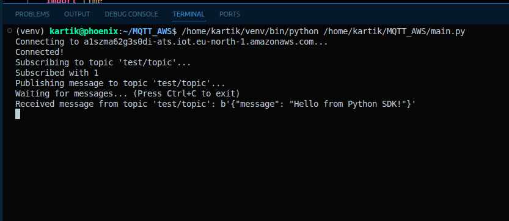
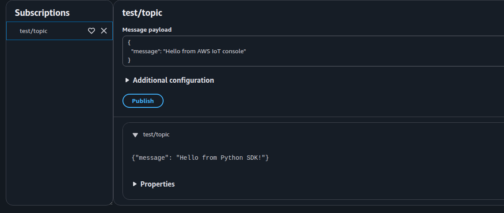
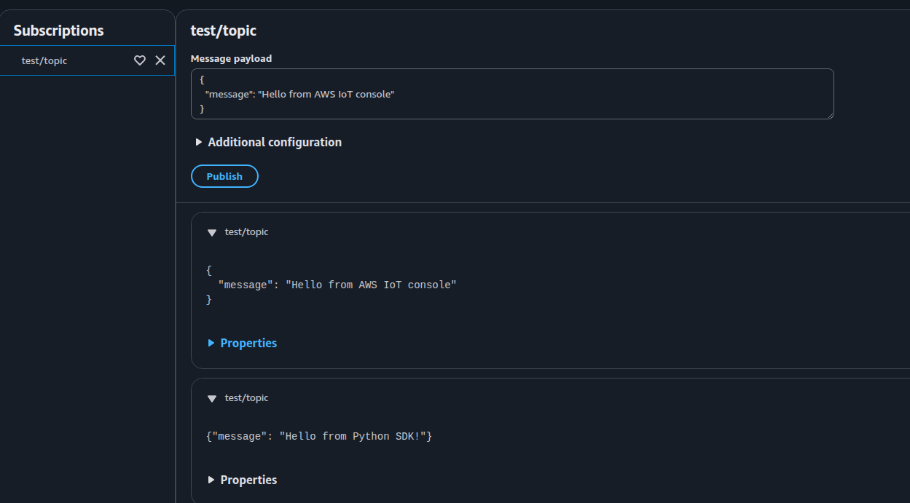
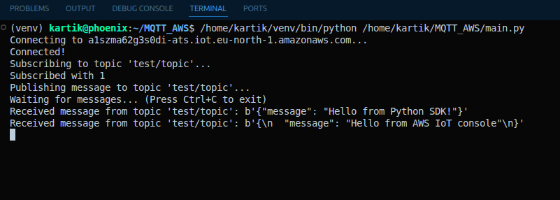

# AWS IoT MQTT Python 

## Description
This project demonstrates MQTT publish and subscribe using AWS IoT Core with Python.

## Steps
1. Connect to AWS IoT Core using certificates
2. Subscribe to a topic
3. Publish messages 

## Screenshots

### AWS IoT MQTT – Subscribe to Topic

### Python MQTT – Publish & Subscribe

### AWS IoT MQTT – Message Received from Python

### AWS IoT MQTT – Publish Message from Console

### Python MQTT – Message Received from AWS Console

